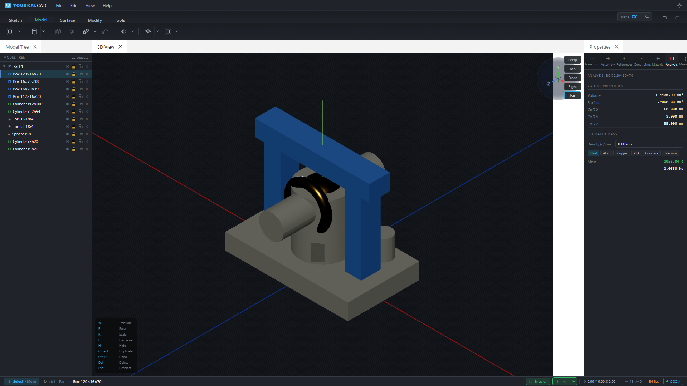

# ToubkalCAD

ToubkalCAD is a browser-based 3D parametric CAD application. It combines
OpenCascade compiled to WebAssembly for solid modeling with Three.js for
rendering and React for the user interface.

**[Launch the live ToubkalCAD app](https://toubkal-cad.vercel.app)**

**[Read the ToubkalCAD documentation](https://toubkal-docs.vercel.app)**

**[Join the ToubkalCAD community discussions](https://github.com/ToubkalCAD/ToubkalCAD/discussions)**

**[Support ToubkalCAD on Ko-fi](https://ko-fi.com/toubkalcad)**

[](https://toubkal-cad.vercel.app)

> **Project status:** ToubkalCAD is under active development. File formats,
> feature behavior, and APIs may change before a stable release.

## Documentation

Visit the **[ToubkalCAD documentation site](https://toubkal-docs.vercel.app)**
for getting started, modeling workflows, reference material, troubleshooting,
contributing, and application architecture. Its source lives in
[`docs/`](docs/index.md).

## Features

- Browser-based solid and surface modeling
- Sketching with geometric constraints
- Parametric feature history and recomputation
- Extrude, revolve, loft, sweep, boolean, fillet, chamfer, shell, and pattern
  operations
- Datum geometry, measurements, materials, and assembly tools
- STEP and IGES exchange through OpenCascade

The implementation roadmap is in [docs/ROADMAP.md](docs/ROADMAP.md).

## Built with

ToubkalCAD is made possible by open-source projects including:

- [OpenCascade.js](https://github.com/donalffons/opencascade.js) — solid
  modeling compiled to WebAssembly
- [PlaneGCS](https://github.com/Salusoft89/planegcs) — geometric constraint
  solving
- [Three.js](https://threejs.org/) — 3D rendering
- [React](https://react.dev/) — user interface
- [Zustand](https://github.com/pmndrs/zustand) — application state management
- [Dockview](https://dockview.dev/) — dockable interface panels

See [Third-party notices](THIRD_PARTY_NOTICES.md) for dependency and licensing
information.

## Requirements

- Node.js 20.19 or newer
- npm 10 or newer
- A modern browser with WebAssembly and `SharedArrayBuffer` support

ToubkalCAD requires cross-origin isolation. Both the development server and
Netlify configuration provide these headers:

```text
Cross-Origin-Opener-Policy: same-origin
Cross-Origin-Embedder-Policy: require-corp
```

If you deploy elsewhere, configure the same headers or the geometry kernel will
not initialize.

## Getting started

```bash
git clone https://github.com/ToubkalCAD/ToubkalCAD.git
cd ToubkalCAD
npm ci
npm run dev
```

Open <http://localhost:8080>. The first load downloads an approximately 48 MB
OpenCascade WASM module; later normal reloads use the browser cache.

On Windows PowerShell installations that block script wrappers, run
`npm.cmd ci` and `npm.cmd run dev`.

## Commands

| Command | Purpose |
| --- | --- |
| `npm run dev` | Start the development server with hot reload |
| `npm run build` | Type-check and create a production build in `dist/` |
| `npm run lint` | Run TypeScript and React Hooks static checks |
| `npm run preview` | Serve a production-mode build locally |
| `npm test` | Run the supported headless test suite |
| `npm run test:solver` | Cross-check the sketch constraint solvers |
| `npm run clean` | Remove generated production files |

The optional SolveSpace solver is skipped when its locally built WASM module is
absent. See [native/slvs/README.md](native/slvs/README.md) for build details.

## Architecture

- `src/components/` — React UI and the Three.js viewport
- `src/hooks/` — interaction handlers for CAD tools
- `src/services/` — OpenCascade operations, recomputation, persistence, and
  geometry conversion
- `src/store/` — Zustand scene graph and application state
- `src/services/solver/` — sketch solver adapters
- `scripts/` — headless regression tests
- `native/slvs/` — optional SolveSpace WebAssembly integration

Persistent OpenCascade shapes are owned by `CADGeometryRegistry`; lightweight
scene metadata lives in the Zustand store. UI-to-viewport communication uses
`window` custom events. See [CLAUDE.md](CLAUDE.md) for the detailed development
architecture and invariants.

## Contributing

Contributions are welcome. Read [CONTRIBUTING.md](CONTRIBUTING.md) before opening
an issue or pull request. Please use GitHub's private security advisory flow for
security reports, as described in [SECURITY.md](SECURITY.md).

## Deployment

The production app is deployed at
[toubkal-cad.vercel.app](https://toubkal-cad.vercel.app). `vercel.json` builds
the project, publishes `dist/`, configures SPA routing, and supplies the required
cross-origin isolation and WASM caching headers. Generated `dist/` files are not
committed.

## License

ToubkalCAD's original source code is licensed under the [MIT License](LICENSE).

Third-party components remain subject to their respective licenses. See
[THIRD_PARTY_NOTICES.md](THIRD_PARTY_NOTICES.md) for details.
